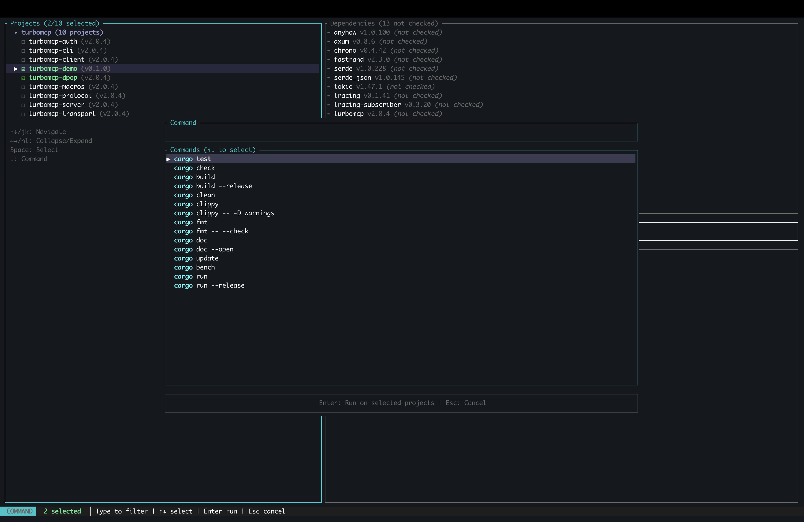

# 🚀 CarWash - Rust Project Manager

A TUI (Terminal User Interface) for managing multiple Rust projects with ease. CarWash provides an intuitive interface for running cargo commands across multiple projects simultaneously, managing dependencies, and monitoring build outputs.

[](https://crates.io/crates/carwash)
[](https://opensource.org/licenses/MIT)



## ✨ Features

### 🎯 Core Features
- **Multi-Project Management**: Automatically discover and manage all Rust projects in a directory tree
- **Parallel Command Execution**: Run cargo commands across multiple projects simultaneously
- **Interactive Command Palette**: Fuzzy search through cargo commands with vim-style navigation
- **Real-time Output Monitoring**: Watch command output with colored syntax highlighting
- **Dependency Management**: Check for outdated dependencies and update them interactively
- **Workspace Support**: Intelligently handles Cargo workspaces and member projects

### 🎨 Enterprise-Grade UX
- **Beautiful UI**: Modern, colorful interface with intuitive layouts
- **Status Indicators**: Real-time status updates with progress indicators
- **Smart Color Coding**: Errors (red), warnings (yellow), success (green)
- **Scrollable Output**: Navigate through large command outputs with keyboard shortcuts
- **Multiple Tabs**: Switch between running commands with arrow keys
- **Project Selection**: Select single or multiple projects with visual checkboxes

### ⌨️ Keyboard-Driven Workflow
- **Vim-style Navigation**: `j/k` for up/down, `h/l` for left/right
- **Quick Commands**: Press `:` to open command palette instantly
- **Space to Select**: Toggle project selection with spacebar
- **Esc to Cancel**: Consistent escape behavior throughout
- **Tab to Toggle**: Switch command scope between selected and all projects

## 📦 Installation

### From crates.io (Recommended)

```bash
cargo install carwash
```

See the package on [crates.io](https://crates.io/crates/carwash).

### From source

```bash
# Clone the repository
git clone https://github.com/epistates/carwash.git
cd carwash

# Build and install
cargo install --path .

# Or run directly
cargo run -- /path/to/your/rust/projects
```

## 🚀 Quick Start

```bash
# Run in current directory
carwash

# Run in specific directory
carwash ~/my-rust-projects

# Show help
carwash --help
```

## 📖 Usage Guide

### Navigation

| Key | Action |
|-----|--------|
| `↑`/`↓` or `j`/`k` | Navigate projects |
| `←`/`→` | Switch output tabs |
| `Space` | Toggle project selection |
| `PgUp`/`PgDown` | Scroll output |

### Commands

| Key | Action |
|-----|--------|
| `:` | Open command palette |
| `u` | Check for dependency updates |
| `?` | Show help screen |
| `q` | Quit application |
| `Ctrl+C` | Force quit |

### Command Palette

1. Press `:` to open the command palette
2. Type to filter commands (fuzzy search)
3. Use `↑`/`↓` or `j`/`k` to select a command
4. Press `Tab` to toggle between **Selected Projects** and **All Projects**
5. Press `Enter` to execute the command
6. Press `Esc` to cancel

### Available Commands

- **test** - Run tests
- **check** - Check for compilation errors
- **build** - Build projects
- **build --release** - Build with optimizations
- **clean** - Remove build artifacts
- **clippy** - Run Clippy lints
- **fmt** - Format code
- **doc** - Generate documentation
- **update** - Update dependencies
- **bench** - Run benchmarks
- **run** - Run the project

### Dependency Updates

1. Select a project
2. Press `u` to check for outdated dependencies
3. Use `Space` to select dependencies to update
4. Press `a` to select all, `n` to select none
5. Press `Enter` to update selected dependencies
6. Press `Esc` to cancel

## 🎯 Workflow Examples

### Running Tests Across Multiple Projects

1. Use `↑`/`↓` to navigate through projects
2. Press `Space` to select projects you want to test
3. Press `:` to open command palette
4. Type "test" or select from list
5. Ensure scope is "Selected Projects"
6. Press `Enter` to run tests in parallel
7. Switch between output tabs with `←`/`→`

### Checking for Updates

1. Select a project (or multiple)
2. Press `u` to check for outdated dependencies
3. Review the list of outdated packages
4. Select packages to update with `Space`
5. Press `Enter` to update

### Building All Projects

1. Press `:` to open command palette
2. Type "build"
3. Press `Tab` to change scope to "All Projects"
4. Press `Enter` to build all projects in parallel

## 🏗️ Architecture

CarWash is built with:

- **[Ratatui](https://github.com/ratatui-org/ratatui)**: Modern TUI framework for Rust
- **[Tokio](https://tokio.rs/)**: Async runtime for parallel command execution
- **[crates.io API](https://crates.io/)**: For checking dependency versions
- **Component-Based UI**: Modular, maintainable UI components
- **Redux-style State Management**: Predictable state updates with reducer pattern

### Project Structure

```
src/
├── main.rs              # Entry point and main event loop
├── app.rs               # Application state and reducer
├── events.rs            # Action and event definitions
├── project.rs           # Project discovery and parsing
├── runner.rs            # Command execution logic
├── ui.rs                # Main UI layout
└── components/
    ├── dependencies.rs  # Dependency viewer
    ├── help.rs          # Help screen
    ├── output.rs        # Output tabs with scrolling
    ├── palette.rs       # Command palette
    ├── projects.rs      # Project list
    ├── status.rs        # Status bar
    ├── text_input.rs    # Text input component
    └── updater.rs       # Update wizard
```

## 🎨 Customization

CarWash uses a carefully chosen color scheme optimized for terminal visibility:

- **Cyan**: Borders, titles, and interactive elements
- **Green**: Success states and selected items
- **Yellow**: Warnings and pending states
- **Red**: Errors and critical information
- **Magenta**: Special modes like update wizard
- **Dark Gray**: Secondary information and help text

## 🤝 Contributing

Contributions are welcome! Areas for improvement:

- [ ] Configuration file support (`.carwashrc`)
- [ ] Custom command templates
- [ ] Project favorites/bookmarks
- [ ] Command history persistence
- [ ] Export/save command outputs
- [ ] Custom color themes
- [ ] Plugin system
- [ ] Remote project support

## 📝 License

[MIT](./LICENSE)

## 🙏 Acknowledgments

Built with:
- [Ratatui](https://github.com/ratatui-org/ratatui) - Amazing TUI framework
- [Tokio](https://tokio.rs/) - Powerful async runtime
- [crates.io API](https://github.com/crates-io/crates.io) - Crate metadata

---

**Made with ❤️ for the Rust community**

For bugs, feature requests, or questions, please open an issue on GitHub.


